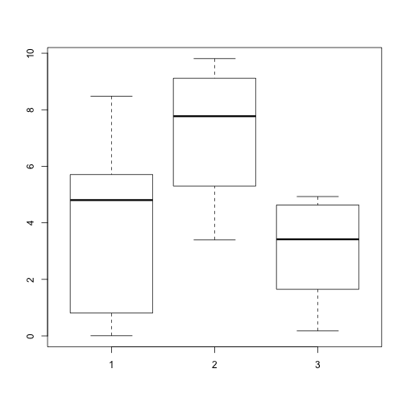
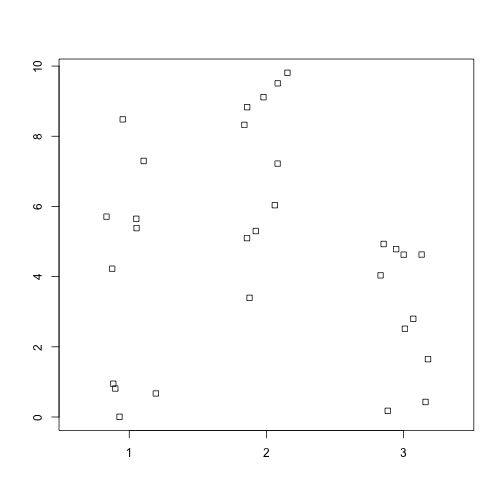
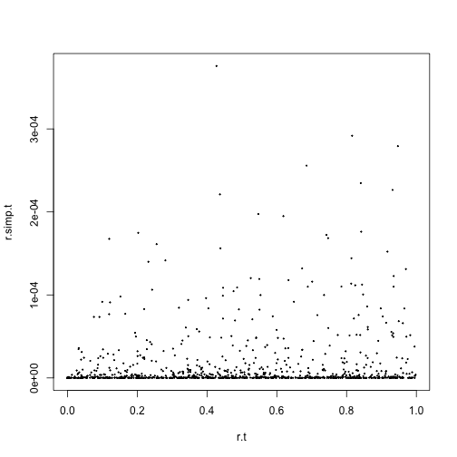
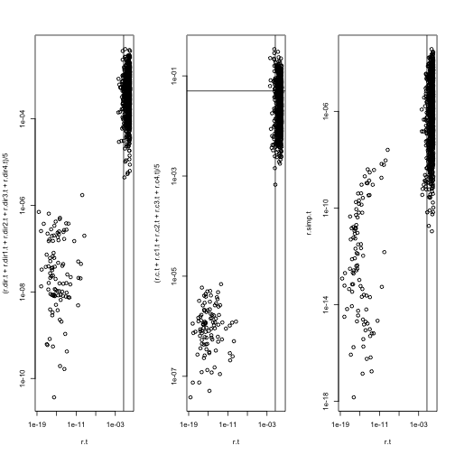
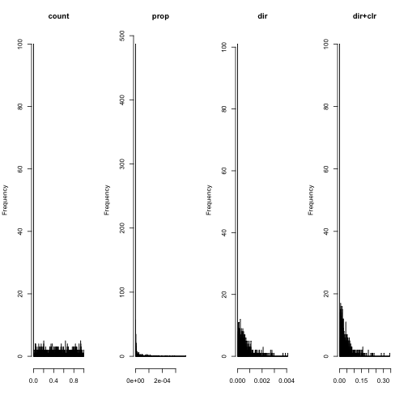

## A minimal R Markdown example


```r
# this is a comment
# everything in R is a vector (or series of values)
# commands or functions use round brackets
# the assignment operator is "<-"

x <- c(1,2,3)
```

The obligatory R markdown cheatsheet: https://www.rstudio.com/wp-content/uploads/2015/02/rmarkdown-cheatsheet.pdf

`?command` is your friend!!!!

### data types
- vector (can be atomic, or other)
- list - vector of arbitrary data types, contain anything
- data.frame (list of different data types where the vectors are same length)
- matrix (vector of vectors of the same data type)

some functions need data.frame, other matrices or lists, you must convert

in R, observations (samples) are typically in rows, and variables (genes, OTUs, etc) are in columns

lets make 3 vectors and examine them
These functions generate random numbers and we can get summary statistics of them.

### three types of brackets
- all functions in R contain their arguments in ( )
- simple subsetting uses [ ]
- all programming is inside { }


```r
# runif() random uniform function to generate pseudo random numbers
# c() concatenation function to make an atomic vector

x <- c(runif(10, 0,10))

y <- c(runif(10,2,10))

z <- c(runif(10,0,5))

mean(x)
```

```
## [1] 3.91789
```

```r
summary(x)
```

```
##    Min. 1st Qu.  Median    Mean 3rd Qu.    Max. 
## 0.00559 0.84540 4.80500 3.91800 5.69300 8.48200
```

we can determine the mean of vector x, or summarize vector x


Those are the simple basics, and equivalent to a 'hello world' in other languages. Now you need to know what the basic functions that you can use. If it is not a dataset, everything in R is a function. You can make your own function if you like, but there are many pre-built functions for manipulating and displaying data.

Now we will check out the basic vocabulary page from Hadley Wickham's advanced R book: http://adv-r.had.co.nz/Vocabulary.html


### lists, matrices, dataframes

Now we can convert xyz into a matrix using cbind. What does the rbind() function do?


```r
xyz.m <- cbind(x,y,z)
xyz.d <- data.frame(x,y,z, stringsAsFactors=F)
xyz.l <- list(x,y,z)
names(xyz.l) <- c("x","y","z")
dim(xyz.m)
```

```
## [1] 10  3
```

We will explore this with
`str`
`dim`
`typeof`

and work on subsetting the data

### functions

Everything that is not data in R is a function. Functions are defined as:

`function.name <- function (parameters) {code}`

So for example, the rdirichlet function that we will use in a moment looks like this:


```r
rdirichlet <- function (n, alpha)
{
  if(length(n) > 1) n <- length(n)
  #if(length(n) == 0 || as.integer(n) == 0) return(numeric(0))
  #n <- as.integer(n)
  if(n < 0) stop("value(n) can not be negative in rtriang")

  if(is.vector(alpha)) alpha <- t(alpha)
  l <- dim(alpha)[2]
  x <- matrix(rgamma(l * n, t(alpha)), ncol = l, byrow=TRUE)  # Gere le recycling
  return(x / rowSums(x))
}
```


### now lets try some plots and at the same time explore what a p value means

we can make random data drawn from a normal distribution using the rnorm function
We can explore by examining the data graphically using either boxplots or stripcharts

generates a boxplot: http://flowingdata.com/2008/02/15/how-to-read-and-use-a-box-and-whisker-plot/

```r
boxplot(x,y,z)
```


generates a stripchart: https://stat.ethz.ch/R-manual/R-devel/library/graphics/html/stripchart.html


```r
# one thing is that they require a list
# jitter moves the values so they overlap less
# try group.names = c("X","Y","Z") as an option
stripchart(list(x,y,z), vertical=TRUE, method="jitter", jitter=0.2)
```



make sure you have the ability to generate and save R markdown documents for next class

for your exploration:

- what is the dimension of xyz as a data.frame or a matrix?

- can you tell the difference between the rnorm and runif outputs for n=3, n=10, n=100?

- what is the difference between these three subset forms?

-- df.xyz$z[1:5]

-- df.xyz[1:5,3]

-- xyz[1:5,"z"]


```r
# the effect of non-independence on P values
# When conducting multiple statistical tests, we assume independence of the tests
# most of the time, this is approximated, but this cannot be true for
# CoDa, where if one value goes up, another must go down in response.
# this breaks a lot of things!!!

# toy example
# first case

size <- 100

r <- matrix(data=NA, nrow=10, ncol=1000)

for(i in 1:10){ r[i,] <- rnorm(1000, mean=100, sd=5) }

for(i in 1:5){ r[i,1:size] <- rnorm(size, mean=1000, sd=5) }


r.simp <- t(apply(r, 1, function(x) x/sum(x)))

r.t <- apply(r, 2, function(x) as.numeric(t.test(x[1:5], x[6:10])[3]) )

r.simp.t <- apply(r.simp, 2, function(x) as.numeric(t.test(x[1:5], x[6:10])[3]) )

plot(r.t, r.simp.t, pch=19, cex=0.2)
```



```r
r.d <- matrix(data=NA, nrow=10, ncol=1000)
r.d1 <- matrix(data=NA, nrow=10, ncol=1000)
r.d2 <- matrix(data=NA, nrow=10, ncol=1000)
r.d3 <- matrix(data=NA, nrow=10, ncol=1000)
r.d4 <- matrix(data=NA, nrow=10, ncol=1000)

for( i in 1:10){ r.d[i,] <- rdirichlet(1,r[i,])}
for( i in 1:10){ r.d1[i,] <- rdirichlet(1,r[i,])}
for( i in 1:10){ r.d2[i,] <- rdirichlet(1,r[i,])}
for( i in 1:10){ r.d3[i,] <- rdirichlet(1,r[i,])}
for( i in 1:10){ r.d4[i,] <- rdirichlet(1,r[i,])}

r.c <- t( apply(r.d, 1, function(x) log(x) - mean(log(x))) )
r.c1 <- t( apply(r.d1, 1, function(x) log(x) - mean(log(x))) )
r.c2 <- t( apply(r.d2, 1, function(x) log(x) - mean(log(x))) )
r.c3 <- t( apply(r.d3, 1, function(x) log(x) - mean(log(x))) )
r.c4 <- t( apply(r.d4, 1, function(x) log(x) - mean(log(x))) )


r.dir.t <- apply(r.d, 2, function(x) as.numeric(t.test(x[1:5], x[6:10])[3]) )
r.dir1.t <- apply(r.d1, 2, function(x) as.numeric(t.test(x[1:5], x[6:10])[3]) )
r.dir2.t <- apply(r.d2, 2, function(x) as.numeric(t.test(x[1:5], x[6:10])[3]) )
r.dir3.t <- apply(r.d3, 2, function(x) as.numeric(t.test(x[1:5], x[6:10])[3]) )
r.dir4.t <- apply(r.d4, 2, function(x) as.numeric(t.test(x[1:5], x[6:10])[3]) )

r.c.t <- apply(r.c, 2, function(x) as.numeric(t.test(x[1:5], x[6:10])[3]) )
r.c1.t <- apply(r.c1, 2, function(x) as.numeric(t.test(x[1:5], x[6:10])[3]) )
r.c2.t <- apply(r.c2, 2, function(x) as.numeric(t.test(x[1:5], x[6:10])[3]) )
r.c3.t <- apply(r.c3, 2, function(x) as.numeric(t.test(x[1:5], x[6:10])[3]) )
r.c4.t <- apply(r.c4, 2, function(x) as.numeric(t.test(x[1:5], x[6:10])[3]) )

par(mfrow=c(1,3))
plot(r.t, (r.dir.t+r.dir1.t+r.dir2.t+r.dir3.t+r.dir4.t)/5, log="xy")
abline(v=0.05)
abline(h=0.05)
plot(r.t, (r.c.t+r.c1.t+r.c2.t+r.c3.t+r.c4.t)/5, log="xy")
abline(v=0.05)
abline(h=0.05)
plot(r.t, r.simp.t, log="xy")
abline(v=0.05)
abline(h=0.05)
```



```r
par(mfrow=c(1,4))
hist(r.t, breaks=1000, main="count", xlab=NULL)
hist(r.simp.t, breaks=1000, main="prop", xlab=NULL)
hist((r.dir.t+r.dir1.t+r.dir2.t+r.dir3.t+r.dir4.t)/5, breaks=1000, main="dir", xlab=NULL)
hist((r.c.t+r.c1.t+r.c2.t+r.c3.t+r.c4.t)/5, breaks=1000, main="dir+clr", xlab=NULL)
```



