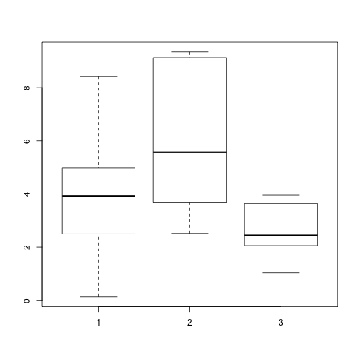
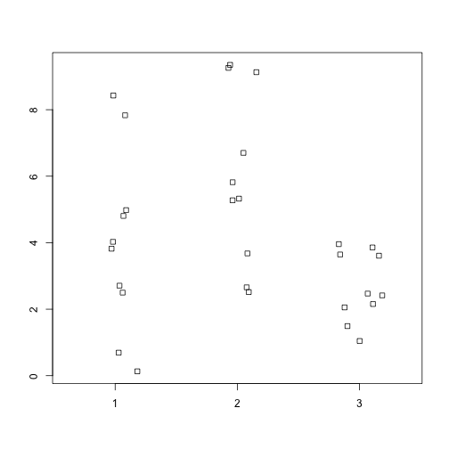

# A minimal R Markdown example


```r
# this is a comment
# this will run inside an R environment if you remove the # before the ?
# ?mean
# generic help built into R about the mean function
# stats'y language
```
everything in R is a vector (or series of values)
x = [x1,x2,x3,...xn]

## data types
- vector
- matrix (2 dimensional vector of the same data type)
- data.frame (2 dimensional vector of different data types)
- list - arbitrary data types, contain anything

some functions need data.frame, other matrices or lists, you must convert

in R, observations (samples) are typically in rows, and variables (genes, OTUs, etc) are in columns

lets make 3 vectors and examine them
These functions generate random numbers and we can get summary statistics of them.


```{r, eval=TRUE}
# all functions in R contain their arguments in ()
# all subsetting uses []
# all programming is inside {}

# <- assignment
# c() concatenation function
# runif() random uniform function to generate pseudo random numbers

x <- c(runif(10, 0,10))
y <- c(runif(10,2,10))
z <- c(runif(10,0,5))

```{r}
# what is the mean value of vector x?

mean(x)
```

```r
## [1] 3.992126
```

```r
mean(y)
```

```
## [1] 5.970781
```

```r
mean(z)
```

```
## [1] 2.669965
```

```r
summary(x)
```

```
##    Min. 1st Qu.  Median    Mean 3rd Qu.    Max. 
##  0.1318  2.5510  3.9230  3.9920  4.9360  8.4270
```

```r
# we can subset from a vector
summary(x)[2]
```

```
## 1st Qu. 
##   2.551
```

Now we can convert xyz into a matrix using cbind. What does the rbind() function do?

```r
xyz <- cbind(x,y,z)
dim(xyz)
```

```
## [1] 10  3
```

```r
is.matrix(xyz)
```

```
## [1] TRUE
```

```r
is.data.frame(xyz)
```

```
## [1] FALSE
```

```r
# or subset xyz matrix to third column and rows 1 to 5

xyz[1:5,3]
```

```
## [1] 3.646010 2.415433 1.043958 2.155368 1.492127
```

```r
# we can make xyz into a data.frame
df.xyz <- as.data.frame(xyz)

# and examine the structure
str(xyz)
```

```
##  num [1:10, 1:3] 7.83 2.71 8.43 2.5 4.03 ...
##  - attr(*, "dimnames")=List of 2
##   ..$ : NULL
##   ..$ : chr [1:3] "x" "y" "z"
```

```r
str(df.xyz)
```

```
## 'data.frame':	10 obs. of  3 variables:
##  $ x: num  7.83 2.71 8.43 2.5 4.03 ...
##  $ y: num  9.26 5.82 9.13 5.28 3.68 ...
##  $ z: num  3.65 2.42 1.04 2.16 1.49 ...
```
we can make random data drawn from a normal distribution using the rnorm function

```r
# drawing 10 values with a mean of 5 and a standard deviation of 2
xn <- rnorm(10,5,2)
```

We can explore by examining the data graphically using either boxplots or stripcharts


```r
# generates a boxplot: http://flowingdata.com/2008/02/15/how-to-read-and-use-a-box-and-whisker-plot/
boxplot(x,y,z)
```

 

```r
# generates a stripchart: https://stat.ethz.ch/R-manual/R-devel/library/graphics/html/stripchart.html
# one thing is that they require a list
# jitter moves the values so they overlap less
# try group.names = c("X","Y","Z") as an option
stripchart(list(x,y,z), vertical=TRUE, method="jitter", jitter=0.2)
```

 

make sure you have the ability to generate and save R markdown documents for next class

for your exploration:

- what is the dimension of xyz as a data.frame or a matrix?

- can you tell the difference between the rnorm and runif outputs for n=3, n=10, n=100?

- what is the difference between these three subset forms?

-- df.xyz$z[1:5]

-- df.xyz[1:5,3]

-- xyz[1:5,"z"]


